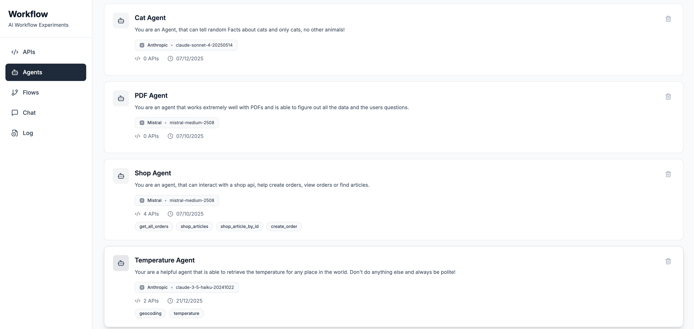
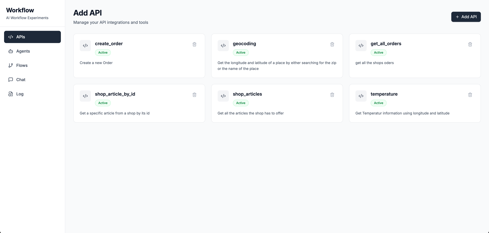
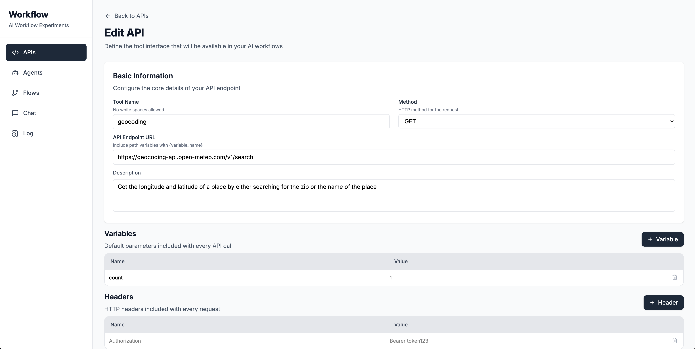
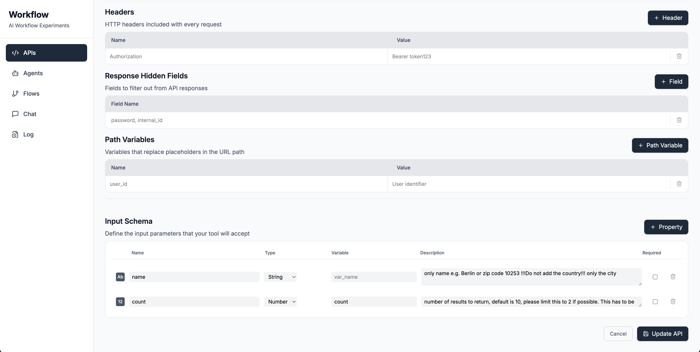
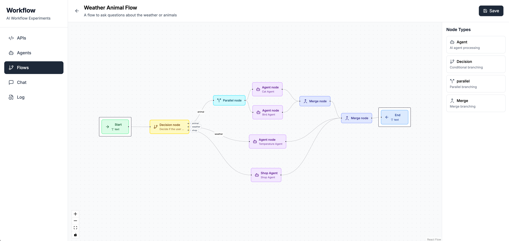
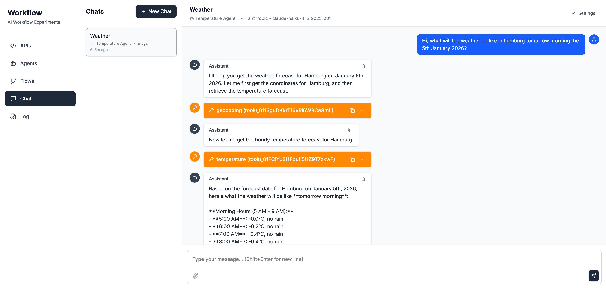

# AI Workflow Experiment

An experimental full-stack application for building AI agents with tool-calling capabilities and visual workflow automation using LLMs.

## What It Does

- Create AI agents that can call external APIs as tools
- Define and manage external APIs for agent use
- Build visual workflow automation with a node-based flow editor
- Chat with AI agents and see tool execution in real-time
- Monitor execution logs and token usage

## Screenshots

### Agent Management


### API Configuration




### Visual Flow Builder


### Chat Interface


## Tech Stack

**Backend:**
- FastAPI + Uvicorn
- PostgreSQL with SQLAlchemy
- Python 3.13+
- Multi-provider LLM support (Claude, Mistral)

**Frontend:**
- React 19 + React Router v7
- TailwindCSS 4
- ReactFlow for visual workflows
- Vite

**Mock Service:**
- Simple FastAPI shop service for testing

## Quick Start with Docker

1. Set up environment variables:
```bash
cp backend/.env.example backend/.env
# Edit backend/.env with your database credentials and API keys
```

2. Start all services:
```bash
docker-compose up
```

3. Access the application:
- Frontend: http://localhost:5173
- Backend API: http://localhost:7777
- API Docs: http://localhost:7777/docs
- Shop Mock Service: http://localhost:8000

The database migrations run automatically on startup.

## Manual Setup

See individual README files in `backend/` and `frontend/` directories for detailed setup instructions.

## Project Structure

```
.
├── backend/           # FastAPI backend with AI agents and flow system
├── frontend/          # React frontend with visual flow editor
└── docker-compose.yml # Docker setup for all services
```

## Features

### AI Agent System
- Automatic tool-calling loop with external API execution
- Support for multiple LLM providers
- Persistent chat sessions with message history

### API Tool Integration
- Define external APIs as tools with JSON schemas
- Support for GET, POST, PUT, DELETE methods
- Dynamic parameter injection and response filtering
- Path variables, query parameters, and headers

### Visual Flow Builder
Six node types for building workflows:
- INPUT: Entry point receiving user input
- OUTPUT: Exit point returning final results
- AGENT: Executes AI agents with tool calling
- DECISION: LLM-based routing between paths
- PARALLEL: Concurrent execution of branches
- MERGE: Combines parallel execution results

### Execution Logging
- Complete execution history for chats and flows
- Token usage tracking
- Message-level logging with timestamps

## Note

This is an experimental project focused on learning and testing LLM integration patterns. It doesn't include comprehensive tests and was validated through end-to-end testing only.
